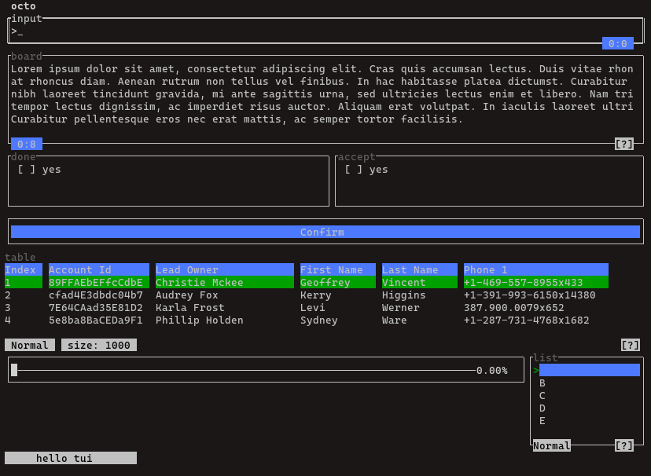

# tui_widget

Terminal UI widget based on [illwill](https://github.com/johnnovak/illwill/tree/master)

The widgets is currently in alpha version. API is getting stable and you're welcome to build yout own text based application. 

**Note** Changes may occured when there are bugs related or changes of designs (likely next version).

### Quick preview



It feels like an old school software, let's stick with the keyboard :D, it is navigate by `[tab]` button between widgets.

`TerminalApp` supports auto-resize and dynamic grid layout of adding widgets too. Check out the docs / examples for how-tos.

### Usage
```shell
git clone https://github.com/jaar23/tui_widget.git

cd tui_widget && nimble install
```

Dependencies

```shell
# base
nimble install illwill@0.4.0

# for paste event
nimble install nimclipboard

# for chart widget
nimble install asciigraph 

# for multi-thread
nimble install threading
nimble install malebolgia
```

### Simple Example

```nim
import tui_widget, illwill

var inputBox = newInputBox(1, 1, consoleWidth(), 3, "message")

var display = newDisplay(1, 4, consoleWidth(), 16, "display panel") 

let enterEv = proc(ib: InputBox, arg: varargs[string]) =
  display.add(inputBox.value & "\n")
  inputBox.value("")

inputBox.onEnter = enterEv

var app = newTerminalApp(title="tui widget")

app.addWidget(inputBox)
app.addWidget(display)

app.run()
```

### Docs

[Getting Started](./docs/getting-started.md), learn how to create a terminal application with `tui_widget` by simple examples.

[Widgets](./docs/widgets.md), widgets API

[Events](./docs/events.md), explain how `tui_widget`'s events works

[TerminalApp](./docs/terminal-app.md), bootstrap widget with `TerminalApp`.

### Examples

Refers to tests / examples folder for example.

- basic [example](./tests/tui_test.nim)

- chart [example](./tests/chart_test.nim)

- gauge [example](./tests/gauge_test.nim)

- display [example](./tests/display_test.nim)

- terminal app and widgets [example](./examples/dir.nim)
  
- auto-align widget [example](./tests/auto_align.nim)
