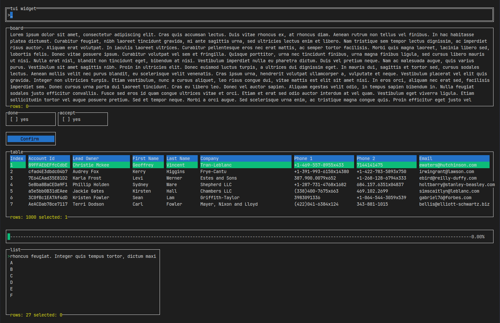
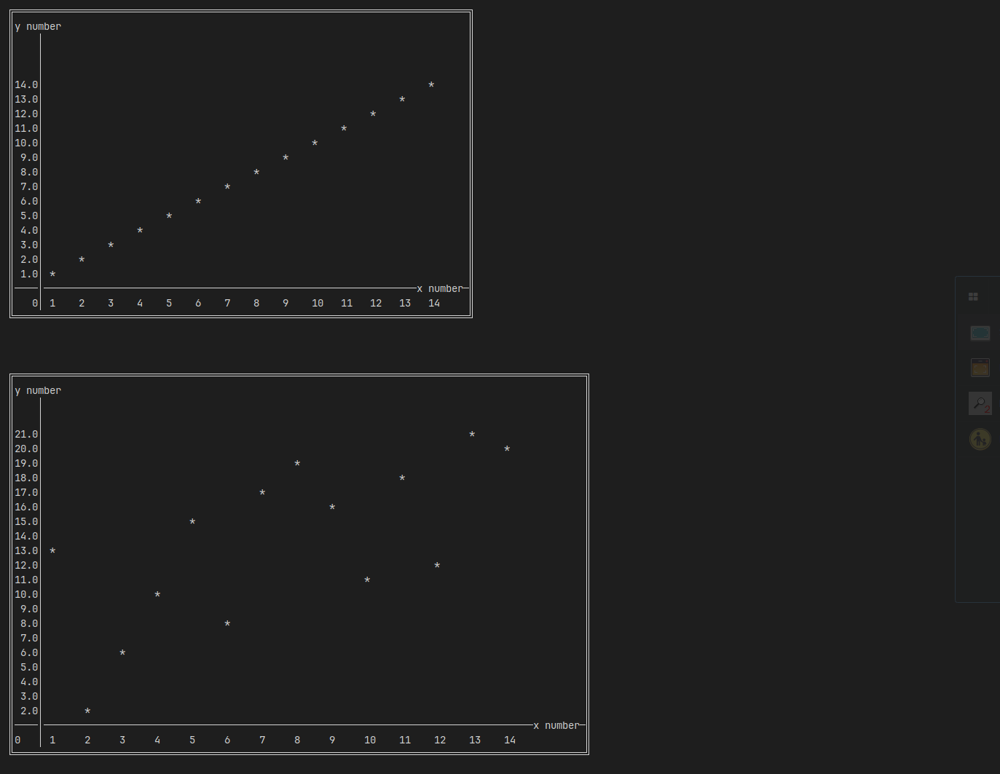

# tui_widget

Terminal UI widget based on [illwill](https://github.com/johnnovak/illwill/tree/master)

These widget is <b>under development</b>, things might change or break!

A quick preview



It feels like an old school software, let's stick with the keyboard :D, it is navigate by `[tab]` button between widgets.

You can use the widget with illwill or bootstrap with `TerminalApp`.

Refers to `tests/tui_test.nim` for example.

Widgets:
- input box (y)

- display panel (y)

- button (y)

- list view (y)

- table (y)

- checkbox (y)

- progressbar (y)

- label (y)

- radio button

- select

- gauge (y)

- charts (y)

After checkout on [asciigraph](https://github.com/Yardanico/asciigraph/tree/master), switch to implement chart with this library instead. It is an awesomeeeeeee library! 

Now it support basic chart feature better, although it still has some limitation. 

  - it do not aggregate the data when display.
  



### Usage

```shell
git clone https://github.com/jaar23/tui_widget.git

cd tui_widget && nimble install
```

### Doc (WIP)

Refers to tests folder for example.

- basic [example](./tests/tui_test.nim)

- chart [example](./tests/chart_test.nim)

- gauge [example](./tests/gauge_test.nim)

- display [example](./tests/display_test.nim)


