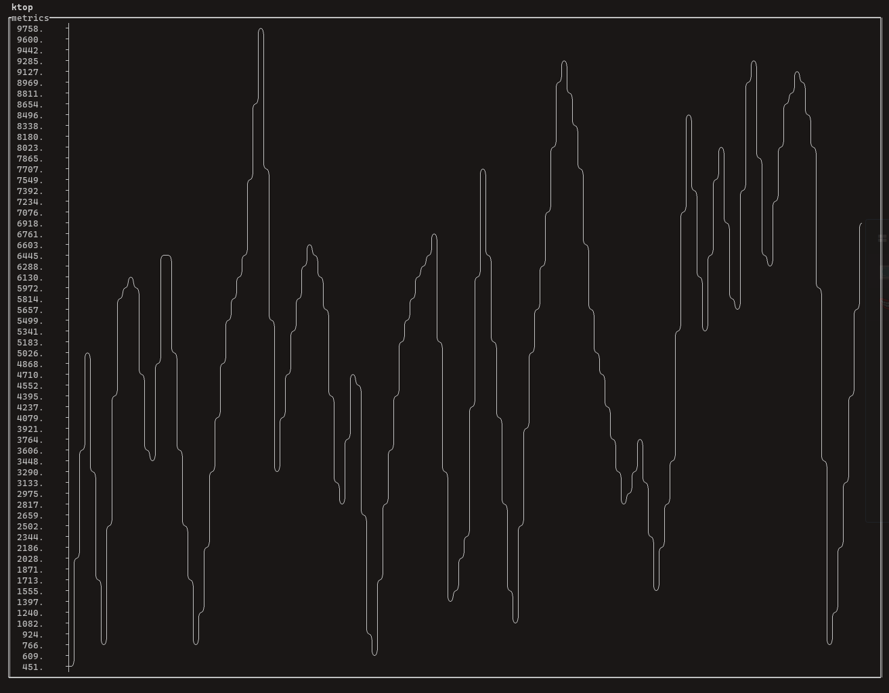

# tui_widget

Terminal UI widget based on [illwill](https://github.com/johnnovak/illwill/tree/master)

These widget is <b>under development</b>, things might change or break!

### Quick preview


It feels like an old school software, let's stick with the keyboard :D, it is navigate by `[tab]` button between widgets.

You can use the widget with illwill or bootstrap with `TerminalApp`.

Refers to `tests/tui_test.nim` for example.

### Widgets:
- input box (y)

- display panel (y)
  
  - some text content does not work well with the default text split, you can define custom text rows split and re-cal on your own

- textarea (y)
  
  - works like a textarea in HTML

  - a naive vi mode implemented, can be enable during init of widget
    
    - pending for `:` implementation

- button (y)

- list view (y)

- table (y)

- checkbox (y)

- progressbar (y)

- label (y)

- radio button

- select (y), listview with onEnter can be used for select widget.

- gauge (y)

- charts (y), powered by [asciigraph](https://github.com/Yardanico/asciigraph/tree/master). It is an awesomeeeeeee library

  - chart have some limitation, it do not aggregate the data when display.


### Usage

```shell
git clone https://github.com/jaar23/tui_widget.git

cd tui_widget && nimble install
```

### Doc (WIP)

Refers to tests folder for example.

- basic [example](./tests/tui_test.nim)

- chart [example](./tests/chart_test.nim)
  
  

- gauge [example](./tests/gauge_test.nim)

- display [example](./tests/display_test.nim)

- terminal app and widgets [example](./examples/dir.nim)
  
  
  

