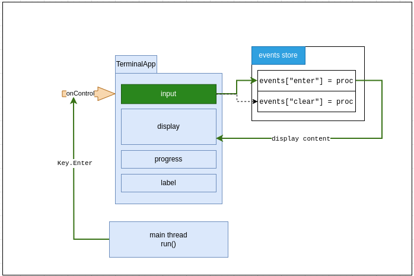
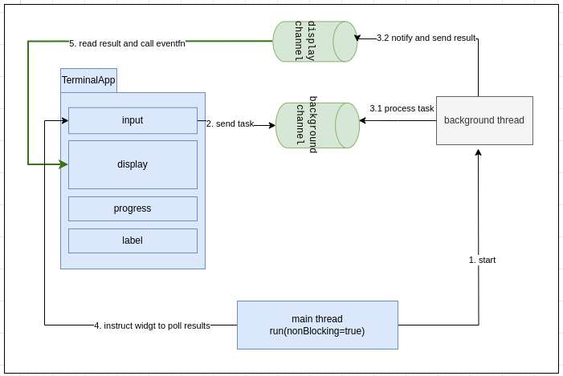

### Event Handling

Widgets that support for events and key-bind events will have `on` function and `call` function.

For example:
```nim
proc on(ib: InputBox; event: string; fn: EventFn[InputBox]) 
```

Register key-bind event on widget
```nim
proc on(lv: ListView; key: Key; fn: EventFn[ListView]) {.raises: [EventKeyError].}
```

`EventFn[T]` is type used to easily capture different type of function. For simplicity, it only support for `vargs[string]` for paramters.

The event proc actually registered on `tables` with `event` name and `EventFn[T]`, developer only required to call the registered event when necessary. This approach become very extensible, since the events can be registered as many as possible.

--- 

`TerminalApp` supports running in blocking and non-blocking mode. Widget under blocking mode will hold the main process when it is `onControl()`, while this behavior may block the events calling for other widgets. I've developed a non-blocking mode which enable the widget to be `onControl` but does not block other widgets' events.

An overview event running under blocking mode



When user send `Key.Enter` action to `input`, it will call the registered event. Then, it will send the new content to `display` widget to display. However, it will stop at this state, since `input` is holding the main process. `display` widget will only update and refresh when user exit from `input` (by `[tab]`). 

Let's check on the non-blocking mode



When user send `Key.Enter` action to `input` this time. The task that blocking the main process is being offload to the background thread. After the background thread is finished processing the task, it will send the result the display's channel. 

At the same time, main process also periodicly polling for new result from all the widget's channel. When it detect there is an result queued in the display channel, it will be polled and call the respective `EventFn` registered on `display` widget. Eventhough `input` widget is still `onControl`, but the event has been fired and updated on other widget.

Of course, there are some limitation on this approach. 

- large number of result registered, the target widget may render multiple times.

- only supported for `EventFn[T]` type.

- task that send to background thread should be `isolated` in order to avoid memory error.

However, terminal application is not design for large application. For application up to certain complexity, you may consider building a full fledge GUI application. Hence, I think this approach still make sense for build a small, lightweight terminal application.

For both example, you may refers to [getting-started](./getting-started.md).

### Next topic: 

- [widgets](./widgets.md)

- [TerminalApp](./terminal-app.md)
