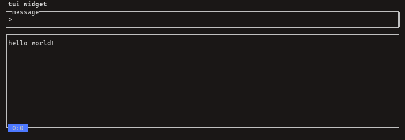
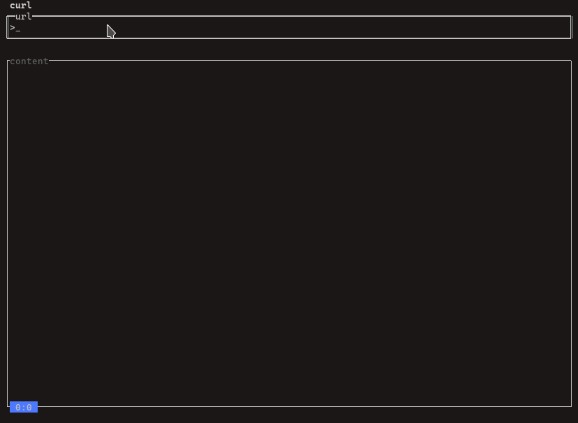

## tui_widget

tui_widget is a widget library that extended from [illwill](https://github.com/johnnovak/illwill) which allows you quickly build a text based application ui with few line of code. Its implementation is opinionated, you can review the available example before using it. 

The library consists of the following widgets:

- button

- checkbox

- chart

- container

- display

- gauge

- input box

- label

- list view

- progress bar

- table

- textarea

Additionally, tui_widget is designed with a modular approach that allows developer to combine the components seamlessly. By using the existing widget, you can extend a table widget with search function, adding event to certain key, update view of the other widget.

The library has encapsulate a lot from illwill, so you start using it straight away. 

### Simple example

In this example, we'll demonstrate how to use an input box and a display panel to create a simple message input and display functionality. 

```nim
import tui_widget, illwill
# 1
var inputBox = newInputBox(1, 1, consoleWidth(), 3, "message")
# 2
var display = newDisplay(1, 4, consoleWidth(), 16, "display panel") 
# 3
let enterEv = proc(ib: InputBox, arg: varargs[string]) =
  display.add(inputBox.value & "\n")
  inputBox.value("")

inputBox.onEnter = enterEv
# 4
var app = newTerminalApp(title="tui widget")

app.addWidget(inputBox)
app.addWidget(display)
# 5
app.run()
```
1. declare `inputBox` with position x (1), position y (1) and took up console width as well as height of 3 row on the terminal.

2. declare `disply` with position x (1), positon y (4) and took up the console width as well as 
height of 16 row on the terminal

3. declare `enterEv`, when use press enter, it will be triggered and add the value of inputbox into display panel, then, clear the inputbox.

4. an application instance that holding all these widgets.

5. run the application. 



Bravo! You've just created a text based application on your terminal. The widgets helps to capture input and display on the ui, you can now focus on your logic, for example, saving the messages into a file, input a file path and display the result on the display panel, etc...

### Intermediate Example

When we are building ui related application, there is always a chance we will be making some I/O calls. I/O calls will be blocking the main thread until something returns. There are two common ways to handle this problem, multi-thread or async await. In tui_widget, it uses the multi-thread method, when you call the `run` function with `nonBlocking` set to true, the app instance will start a background thread to handle tasks that are blocking to the main thread. 
The example above is running in blocking mode and single threaded, if you do not mind a slight freeze on the ui, the blocking mode will serve you fine. However, if you want your terminal app feels reactive, the example below will show you how.

Reusing the example above, we will modify it to make a http call and output the result on display panel.

```nim
import tui_widget
import httpclient, net, os, std/tasks

# tui widget can run in non blocking mode by setting nonBlocking=true in run proc
# when making http request, the screen does not freeze and render once content
# is ready.

var input = newInputBox(1, 1, consoleWidth(), 3, title="url")

var display = newDisplay(1, 5, consoleWidth(), consoleHeight(), id="display", title="content")

var app = newTerminalApp(title="curl", border=false)

# 1
display.on("display", proc(dp: Display, args: varargs[string]) =
  dp.text = args[0]
)

# 2
let httpCall = proc (appPtr: ptr TerminalApp, id: string, url: string) {.gcsafe.} =
  var client = newHttpClient(sslContext=newContext(verifyMode=CVerifyPeerUseEnvVars))
  defer:
    client.close()
  try:
    let content = client.getContent(url)
    sleep(2000)

    # notify main thread when task is done
    notify(appPtr, id, "display", content)
  except:
    let err = getCurrentExceptionMsg()
    notify(appPtr, id, "display", err)

# 3
let enterEv = proc (ib: InputBox, args: varargs[string]) =
  try:
    let url = ib.value
    ib.value = ""
    
    # create a task and passing it to the background thread
    let httpCallTask = toTask httpCall(addr app, display.id, url)

    # running the task in background
    runInBackground(httpCallTask)
  except:
    echo "task exception"
    echo getCurrentExceptionMsg()


input.on("enter", enterEv)

app.addWidget(input)

app.addWidget(display)

# 4
app.run(nonBlocking=true)
```

1. On the display widget, we are registering an event, "display" which will output the http request result on the panel

2. A function which make http request, it is always purposely `sleep(2000)` to simulate a slow network. This function take in 3 parameters:

  - `ptr TerminalApp`, pointer of TerminalApp

  - `id`, display widget id

  - `url`, url for making http request.

  you may notice that these paramters are used to notify the application that there is new content available, please call the "display" event we have registered earlier.

3. `enterEv`, used to capture the enter event on input, it will convert the `httpCall` function to `task` and running it in the background via `runInBackground`.

4. Letting terminal app to run in non-blocking mode, which is specifically designed for such scenario.



The implementation is opinionated, to balance the complexity and usability of a tui library, I prefer this way.

I believe you are now ready to start build your first text based application with tui_widget!

---

### Next topic: 

- [widgets](./widgets.md)

- [TerminalApp](./terminal-app.md)

- [events](./events.md)
