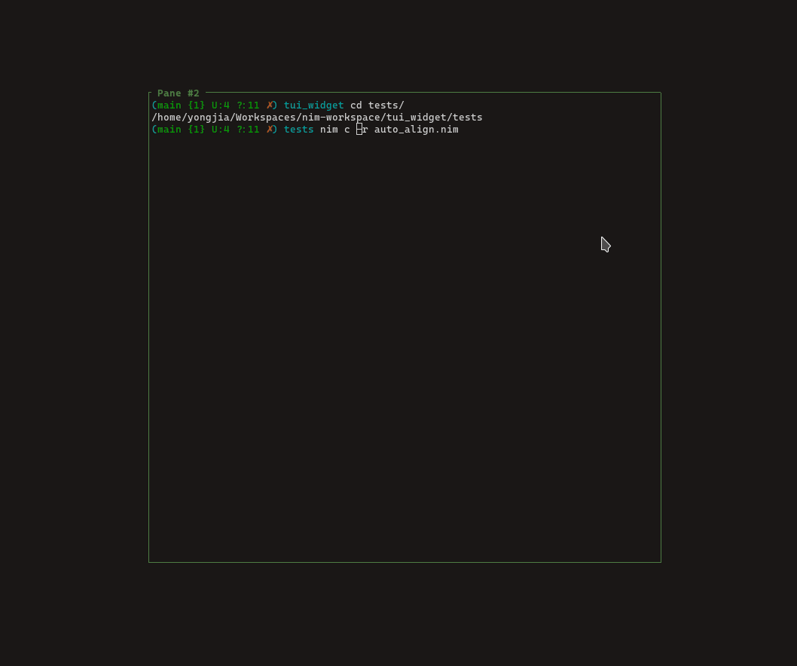
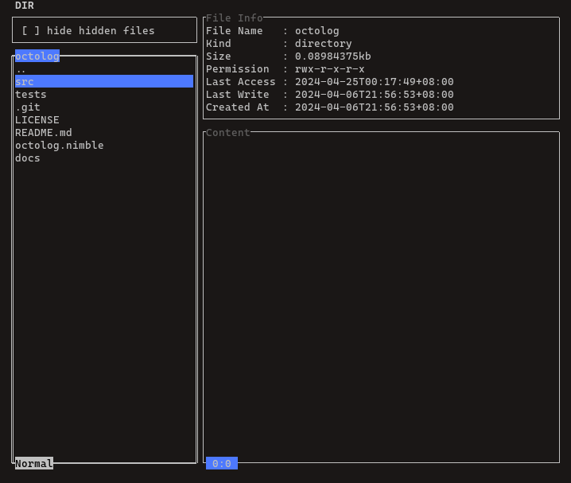

## <a id="top">TerminalApp</a>

`TerminalApp` is the main container that holding all the widgets, it support for the following features:

- main loop of the terminal application (blocking and non-blocking mode)

- dynamic layout for rendering widgets

- auto-resize 

  

- event handling for widgets

  

There are some of the features still under development: 

- error handling

- menu bar widget


### **type** TerminalApp

```nim
TerminalApp = object
 autoResize*: bool = true
```

### **proc** newTerminalApp

Create a `TerminalApp` object with the current console size. `rpms` is refer to refresh per milliseconds. The larger the value, the slower the UI render
```nim
proc newTerminalApp(
  tb: TerminalBuffer = newTerminalBuffer(terminalWidth(), terminalHeight()); 
  title: string = ""; 
  border: bool = false;
  bgColor = illwill.bgNone; 
  fgColor = illwill.fgWhite;
  rpms: int = 20): TerminalApp 
```

### **proc** terminalBuffer

Get terminal buffer of `TerminalApp`
```nim
proc terminalBuffer(app: var TerminalApp): var TerminalBuffer 
```

### **proc** addWidget

Add new widget to `TerminalApp`, the widget needs to be initialize with `posX`, `posY`, `width` and `height`.
```nim
proc addWidget(app: var TerminalApp; widget: ref BaseWidget) {.raises: [Exception], tags: [RootEffect].}
```

### **proc** addWidget

Add new widget to `TerminalApp` with fixed width and height.

**Note** use this function when you want to dynamic layout the widget. However, you will need to calculate the width and height yourself.

```nim
proc addWidget(
  app: var TerminalApp; 
  widget: ref BaseWidget; 
  width: int;
  height: int) {.raises: [Exception], tags: [ReadEnvEffect, RootEffect].}
```

### **proc** addWidget

`addWidget` by float value (percentage) works similar to `Container` widget, but it is relying on the console size.

```shell
+-------------------------------+
| input box  (1.0, 0.2)         |
+-------------------------------+
| display (1.0, 0.4)            |
|                               |
|                               |
+-------------------------------+
| listview        | table       |
+-------------------------------+
| (0.6, 0.4)      | (0.4, 0.4)  |
|                 |             |
|                 |             |
+-------------------------------+
```
`input box (1.0, 0.2)` -> input box will occupied 100% width and 20% height of the container size.

`display (1.0, 0.4)` -> display will occupied 100% width and 40% height of the container

`listview (0.6, 0.4)` -> listview will occupied 60% of width and 40% of height of the container

`table (0.4, 0.4)` -> table will occupied 40% of width and 40% of height of the container.

Add new widget to `TerminalApp` with percentage

```nim
proc addWidget(
  app: var TerminalApp; 
  widget: ref BaseWidget;
  width, height: WidgetSize) {.raises: [Exception], tags: [ReadEnvEffect, RootEffect].}
```

### **proc** addWidget

Add new widget to `TerminalApp` with fixed width and height based on percentage of console size
```nim
proc addWidget(
  app: var TerminalApp; 
  widget: ref BaseWidget; 
  width: int;
  height: WidgetSize) {.raises: [Exception], tags: [ReadEnvEffect, RootEffect].}
```

### **proc** addWidget

Add new widget to `TerminalApp` with fixed height and width based on percentage of console size
```nim
proc addWidget(
  app: var TerminalApp; 
  widget: ref BaseWidget; 
  width: WidgetSize;
  height: int = 0) {.raises: [Exception], tags: [ReadEnvEffect, RootEffect].}
```

### **proc** widgets

Return a list of widget
```nim
proc widgets(app: var TerminalApp): seq[ref BaseWidget] 
```

### **proc** `[]=`

Add a widget by defining / overwrite a id of the widget. This underneath call the `addWidget` above

```nim
proc `[]=`(app: var TerminalApp; id: string; widget: ref BaseWidget): void
```

### **proc** `[]`

Get a widget by id, return none if not found
```nim
proc `[]`(app: var TerminalApp; id: string): Option[ref BaseWidget] 
```

### **proc** requiredSize

Calculate the required size to start terminal application.
```nim
proc requiredSize(app: var TerminalApp): (int, int, int) 
```

### **proc** render

Render all the widgets in `TerminalApp`
```nim
proc render(app: var TerminalApp; nonBlocking = false) {.raises: [Exception], tags: [RootEffect].}
```

### **proc** runInBackground

Sending task to background thread via channel. This accept only isolated variable in tasks, read more on `std/tasks`.

```nim
proc runInBackground(task: sink Task) 
```
<p><strong>Example</strong> 

```nim
let httpCallTask = toTask httpCall(addr app, display.id, url) 
runInBackground(httpCallTask)
```


### **proc** notify

Notify widget via its channel, then widget will be poll by main thread and widget event will be called. 

**Note** There is only string args supported for simplicity

```nim
proc notify(app: ptr TerminalApp; id: string; event: string;
 args: varargs[string]) 
```
<strong>Example</strong> 

  ```nim
  display.on("refresh", proc(dp: ref Display, args: varargs[string]) =
      dp.text = args[0]
    )
  ```
  You may be making a http call and the call is coming back in a later time, the task is running in background and you want it to notify you once the result is ready. Then, you can using notify inside the background task</p>
<p>
<strong>Example</strong> 

```nim
# run with -d:ssl
proc httpRequest(url: string, app: ptr TerminalApp, id: string) =
  var client = newHttpClient(sslContext=newContext(verifyMode=CVerifyPeerUseEnvVars))
  defer: client.close()
  try:
    let content = client.getContent(url)
    notify(app, id, "refresh", content) # notify the widget
  except:
    notify(app, id, "refresh", getCurrentExceptionMsg())
```

### **proc** run

Run the `TerminalApp`. 

**Note** non-blocking mode is required to enable reactive event.

**Note** default running in blocking mode.

**Note** auto-resize is enabled by default

```nim
proc run(
  app: var TerminalApp; 
  nonBlocking = false
) {.raises: [IllwillError, IOError, ValueError, Exception], tags: [ReadEnvEffect, WriteIOEffect, TimeEffect, RootEffect].}
```

[back to top](#top)

### Next topic: 

- [widgets](./widgets.md)

- [events](./events.md)
