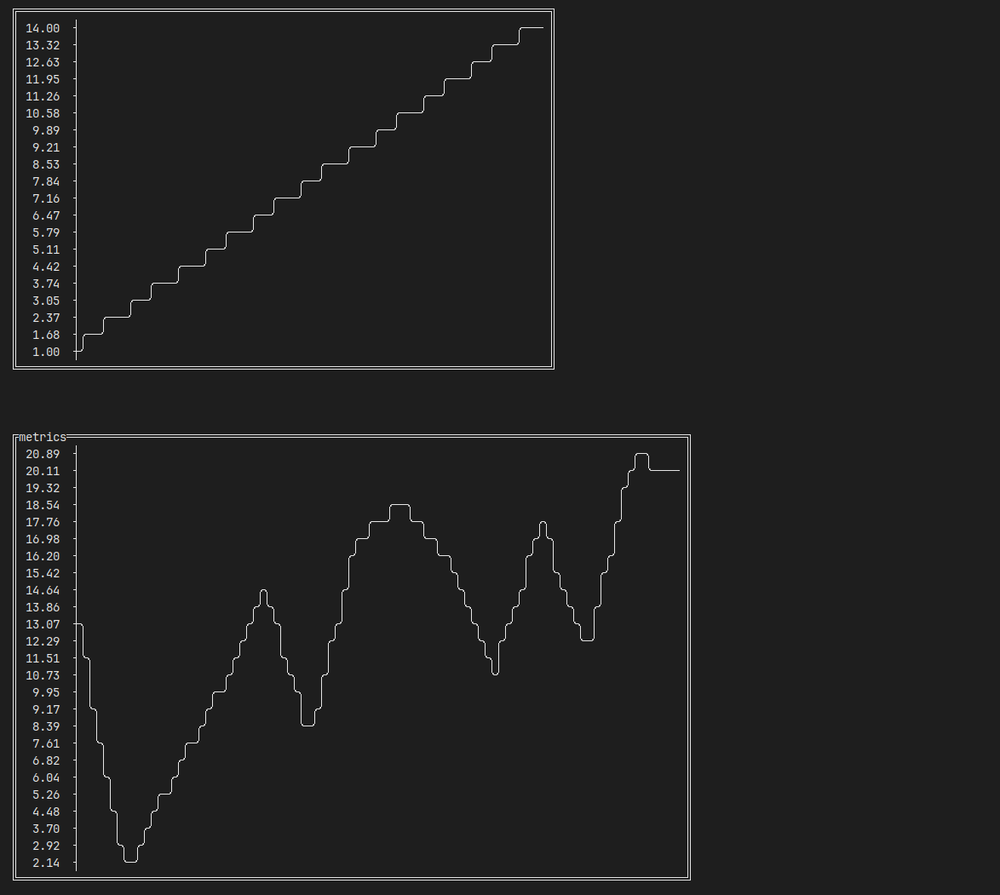
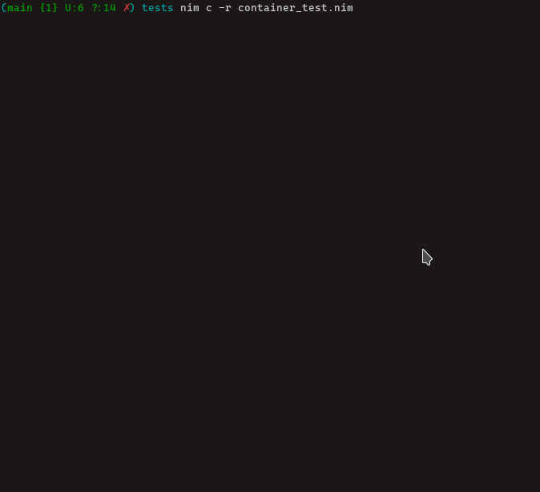
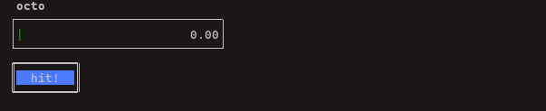
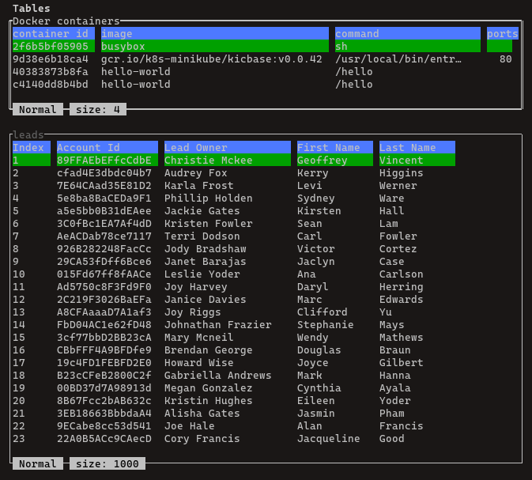

# API: tui_widget

## <a id="top">Widgets</a>:

- [BaseWidget](#basewg)

- [Button](#buttonwg)

- [Container](#containerwg)

- [Charts (experimental)](#chartwg)

- [Checkbox](#chboxwg)

- [Display](#displaywg)

- [Gauge](#gaugewg)

- [InputBox](#inputboxwg)
  
- [Label](#labelwg)

- [ListView](#listviewwg)

- [ProgressBar](#pbwg)

- [Table](#tablewg)

- [Textarea](#textareawg)


## <a id="basewg"> Base Widget </a>

Base widget is a common object that share among widgets, it contains all the necessary attributes and function to manipulate the looks and feel of a widget.


### **type** Alignment


```nim
Alignment = enum
 Left, Center, Right
```

### **type** Mode


```nim
Mode = enum
 Normal, Filter
```

### **type** SelectionStyle


```nim
SelectionStyle = enum
 Highlight, Arrow, HighlightArrow
```

### **type** ViMode


```nim
ViMode = enum
 Normal, Insert, Visual
```

### **type** CursorStyle


```nim
CursorStyle = enum
 Block, Ibeam, Underline
```

### **type** WidgetSize


```nim
WidgetSize = range[0.0 .. 1.0]
```

### **type** WidgetStyle


```nim
WidgetStyle = object
 fgColor*: ForegroundColor
 bgColor*: BackgroundColor
 border*: bool
 paddingX1*: int
 paddingX2*: int
 paddingY1*: int
 paddingY2*: int
 pressedBgcolor*: BackgroundColor
```

### **type** WidgetBgEvent


```nim
WidgetBgEvent = object
 widgetId*: string
 event*: string
 args*: seq[string]
 error*: string
```

### **type** BaseWidget


```nim
BaseWidget = object of RootObj
 width*: int
 height*: int
 posX*: int
 posY*: int
 size*: int
 id*: string = ""
 title*: string
 focus*: bool = false
 tb*: TerminalBuffer
 style*: WidgetStyle
 cursor*: int = 0
 rowCursor*: int = 0
 colCursor*: int = 0
 statusbar*: bool = true
 statusbarText*: string = ""
 statusbarSize*: int = 0
 useCustomStatusbar*: bool = false
 visibility*: bool = true
 groups*: bool = false
 debug*: bool = false
 rpms*: int = 50
 illwillInit*: bool = false
 blocking*: bool = false
 helpText*: string = ""
 enableHelp*: bool = true
 origWidth*: int
 origHeight*: int
 origPosX*: int
 origPosY*: int
```

### **type** EventFn

The event function should use this type in order to register on the widget.

```nim
EventFn[T] = proc (wg: T; args: varargs[string]): void
```

### **type** BoolEventFn

The event function should use this type in order to register on the widget which return `true` or `false` result, for example, checkbox widget.

```nim
BoolEventFn[T] = proc (wg: T; arg: bool): void
```

### **type** EventKeyError

Error type when trying to register a function to forbidden key.
```nim
EventKeyError = object of CatchableError
```

### **type** XYInitError

Error type when widget does not init with correct `posX` and `posY`

```nim
XYInitError = object of CatchableError
```

### **proc** consoleWidth

Extending from `terminalWidth()` function to fit the size of the terminal buffer

```nim
proc consoleWidth(): int 
```

### **proc** consoleHeight

Extending from `terminalHeight()` function to fit the size of the terminal buffer
```nim
proc consoleHeight(): int 
```

### **method** onControl

Widget is focused and running in blocking mode, all the key event will be direct to the widget that is currently `onControl`. On UI, you should see the focused widget has a bright title (when border is off) or double line border (when border is on). 

To exit the onControl loop, you can:
- `[tab]` key event

- `widget.focus = false`

```nim
method onControl(this: ref BaseWidget): void {.base.}
```

### **method** onUpdate

Sending key event from main loop to widget. If there are any custom key events is set, it will be call within this method.

```nim
method onUpdate(this: ref BaseWidget; key: Key): void {.base.}
```

### **method** call

Calling the registered event of the widget. Nothing will be perform if there is no such event.

```nim
method call(this: ref BaseWidget; event: string; args: varargs[string]): void {. base.}
```

Example

```nim
var button = newButton(id="btn")
button.on("press", proc (btn: Button, args: vargs[string]) = btn.label = "pressed")
...
button.call("press")
```

### **method** call

Calling the registered event of the widget. Nothing will be perform if there is no such event.

```nim
method call(this: ref BaseWidget; event: string; args: bool): void {.base, raises: [].}
```

Example

```nim
var ch = newCheckbox(id="ch1")
let chEv = proc (ch: Checkbox, checked: bool) =
  # some function

ch.on("check", chEv)
...
ch.call("check")
```

### **method** call

Calling the registered event of the widget. Nothing will be perform if there is no such event. Similar to previous call function but accept non `ref` object

```nim
method call(this: BaseWidget; event: string; args: varargs[string]): void {. base.}
```

### **method** call

Calling the registered event of the widget. Nothing will be perform if there is no such event. Similar to previous call function but accept non `ref` object

```nim
method call(this: BaseWidget; event: string; args: bool): void {.base, raises: [].}
```

### **method** poll

After event finished run in background, you can choose to notify the widget or not. If the notify event is called, the task result will be store in widget channel. The `poll` method used to get the result and call the necessary registered event in the widget. This method normally consume by the main loop.


```nim
method poll(this: ref BaseWidget): void {.base.}
```

### **proc** channel=

Widget's channel to store event result.

```nim
proc channel=(this: ref BaseWidget; channel: Chan[WidgetBgEvent]) 
```

### **proc** channel

Widget's channel to store event result.
```nim
proc channel(this: ref BaseWidget): var Chan[WidgetBgEvent] 
```

### **proc** channel=

Widget's channel to store event result.
```nim
proc channel=(this: var BaseWidget; channel: Chan[WidgetBgEvent]) 
```

### **proc** channel

Widget's channel to store event result.
```nim
proc channel(this: var BaseWidget): var Chan[WidgetBgEvent] 
```

### **proc** asRef

Create a reference from the variable. 

**Note**: the reference created is new, for widget reference created using this `proc` will be synced.
```nim
proc asRef[T](x: T): ref T
```

### **method** render

Render the widget.

```nim
method render(this: ref BaseWidget): void {.base.}
```

### **method** wg

Get the widget instance
```nim
method wg(this: ref BaseWidget): ref BaseWidget {.base.}
```

### **method** setChildTb

Set child widget to use the parent `terminalBuffer` that is `group` under `Container` widget. For custom created widget that also group widgets under another, you should set `group=true` and run this method.
```nim
method setChildTb(this: ref BaseWidget; tb: TerminalBuffer): void {.base, raises: [].}
```

### **method** onError (experimental)

Widget error handling

```nim
method onError(this: ref BaseWidget; errorCode: string) {.base.}
```

### **proc** bg

Set widget background color.
```nim
proc bg(bw: ref BaseWidget; bgColor: BackgroundColor) 
```

### **proc** fg

Set widget foreground color.
```nim
proc fg(bw: ref BaseWidget; fgColor: ForegroundColor) 
```

### **proc** bg

Get widget background color
```nim
proc bg(bw: ref BaseWidget): BackgroundColor 
```

### **proc** fg

Get widget foreground color
```nim
proc fg(bw: ref BaseWidget): ForegroundColor 
```

### **proc** border

Set widget render with border
```nim
proc border(bw: ref BaseWidget; bordered: bool) 
```

### **proc** border

Get widget border attribute (whether it is enable or not)
```nim
proc border(bw: ref BaseWidget): bool 
```

### **proc** border=

Set widget render with border
```nim
proc border=(bw: ref BaseWidget; bordered: bool) 
```

### **proc** padding

Set widget padding
```nim
proc padding(bw: ref BaseWidget; x1: int; x2: int; y1: int; y2: int) 
```

### **proc** paddingX

Set widget padding on the left and right
```nim
proc paddingX(bw: ref BaseWidget; x1: int; x2: int) 
```

### **proc** paddingY

Set widget padding on the top and bottom
```nim
proc paddingY(bw: ref BaseWidget; y1: int; y2: int) 
```

### **proc** paddingX1

Set widget padding on the left
```nim
proc paddingX1(bw: ref BaseWidget): int 
```

### **proc** paddingX2

Set widget padding on the right
```nim
proc paddingX2(bw: ref BaseWidget): int 
```

### **proc** paddingY1

Set widget padding on top
```nim
proc paddingY1(bw: ref BaseWidget): int 
```

### **proc** paddingY2

Set widget padding on bottom
```nim
proc paddingY2(bw: ref BaseWidget): int 
```

### **proc** widthPaddLeft

Get widget starting `x` position with padding.
```nim
proc widthPaddLeft(bw: ref BaseWidget): int 
```

### **proc** widthPaddRight

Get widget ending `x` position with padding.
```nim
proc widthPaddRight(bw: ref BaseWidget): int 
```

### **proc** heightPaddTop

Get widget starting `y` position with padding.
```nim
proc heightPaddTop(bw: ref BaseWidget): int 
```

### **proc** heightPaddBottom

Get widget ending `y` position with padding.
```nim
proc heightPaddBottom(bw: ref BaseWidget): int 
```

### **proc** offsetLeft

Get widget starting `x` position with offset padding.
```nim
proc offsetLeft(bw: ref BaseWidget): int 
```

### **proc** offsetRight

Get widget ending `x` position with offset padding.
```nim
proc offsetRight(bw: ref BaseWidget): int 
```

### **proc** offsetTop

Get widget starting `y` position with offset padding.
```nim
proc offsetTop(bw: ref BaseWidget): int 
```

### **proc** offsetBottom

Get widget ending `y` position with offset padding.
```nim
proc offsetBottom(bw: ref BaseWidget): int 
```

### **proc** x1

Shortcut for `widthPaddLeft`
```nim
proc x1(bw: ref BaseWidget): int 
```

### **proc** y1

Shortcut for `widthPaddRight`
```nim
proc y1(bw: ref BaseWidget): int 
```

### **proc** x2

Shortcut for `heightPaddTop`
```nim
proc x2(bw: ref BaseWidget): int 
```

### **proc** y2

Shortcut for `heightPaddBottom`
```nim
proc y2(bw: ref BaseWidget): int 
```

### **proc** toConsoleWidth

Convert float value to int value by current console width
```nim
proc toConsoleWidth(w: float): int 
```

### **proc** toConsoleHeight

Convert float value to int value by current console height
```nim
proc toConsoleHeight(h: float): int 
```

### **method** resize

Called when widget is resize. Internally, it perform a calculation on `y1` and `y2`.
```nim
method resize(bw: ref BaseWidget): void {.base.}
```

### **proc** keepOriginalSize

Keep track of widget original size for later widget resize action.
```nim
proc keepOriginalSize(bw: ref BaseWidget) 
```

### **proc** fill

Override illwill fill with diff foreground and background Fills a rectangular area with the <tt class="docutils literal"><span class="pre"><span class="Identifier">ch</span></span></tt> character using the current text attributes. The rectangle is clipped to the extends of the terminal buffer and the call can never fail.

```nim
proc fill(tb: var TerminalBuffer; x1, y1, x2, y2: Natural;
 bgColor: BackgroundColor; fgColor: ForegroundColor; ch: string = " ") 
```

### **proc** renderBorder

Render widget border if border is enable
```nim
proc renderBorder(bw: ref BaseWidget) 
```

### **proc** renderTitle

Render widget title if there is title
```nim
proc renderTitle(bw: ref BaseWidget; index: int = 0) 
```

### **proc** renderCleanRow

Clean the row at `y` positon
```nim
proc renderCleanRow(bw: ref BaseWidget; index = 0; cleanWith = " ") 
```

### **proc** renderCleanRect

Clean a rectangle area base on `x1, y1, x2, y2` positon
```nim
proc renderCleanRect(bw: ref BaseWidget; x1, y1, x2, y2: int; cleanWith = " ") 
```

### **proc** renderRect

Render a rectangle area base on `x1, y1, x2, y2` positon
```nim
proc renderRect(bw: ref BaseWidget; x1, y1, x2, y2: int;
 bgColor: BackgroundColor; fgColor: ForegroundColor;
 fillWith = " ") 
```

### **proc** renderRow

Render a row based on `y` positon
```nim
proc renderRow(bw: ref BaseWidget; content: string; index: int = 0) 
```

### **proc** renderRow

Render a row based on `y` positon with background and foreground color
```nim
proc renderRow(bw: ref BaseWidget; bgColor: BackgroundColor;
 fgColor: ForegroundColor; content: string; index: int = 0;
 withoutPadding = false) 
```

### **proc** clear

Clear the screen. Default will be clearing with widget background and foreground color.
```nim
proc clear(bw: ref BaseWidget) 
```

### **proc** rerender

Calling `clear` and `render`
```nim
proc rerender(bw: ref BaseWidget) {.raises: [Exception], tags: [RootEffect].}
```

### **method** resetCursor

Reset widget cursor. Use it when there is a new content being replaced in the widget
```nim
method resetCursor(bw: ref BaseWidget): void {.base.}
```

### **proc** show

Show widget
```nim
proc show(bw: ref BaseWidget; resetCursor = false) {.raises: [Exception], tags: [RootEffect].}
```

### **proc** hide

Hide widget
```nim
proc hide(bw: ref BaseWidget) 
```

### **proc** experimental

Render the experimental tag1 on widget
```nim
proc experimental(bw: ref BaseWidget) 
```
**Note** since all the widgets are inherit from `BaseWidget`, the method above will be available to them.

<a href="#top">back to top</a>

---


## <a id="buttonwg">Button</a>

### **type** ButtonObj


```nim
ButtonObj = object of BaseWidget
 disabled*: bool = false
 events*: Table[string, EventFn[ref ButtonObj]]
 keyEvents*: Table[Key, EventFn[ref ButtonObj]]
```

### **type** Button


```nim
Button = ref ButtonObj
```

### **proc** newButton


```nim
proc newButton(px, py, w, h: int; 
  label: string; 
  id = ""; 
  disabled = false;
  bgColor = bgBlue; 
  fgColor = fgWhite; 
  pressedBgColor = bgGreen;
  tb = newTerminalBuffer(w + 2, h + py)): Button 
```

### **proc** newButton


```nim
proc newButton(px, py: int; 
  w, h: WidgetSize; 
  label: string; 
  id = "";
  disabled = false; 
  bgColor = bgBlue; 
  fgColor = fgWhite;
  pressedBgColor = bgGreen;
  tb = newTerminalBuffer(toInt(w) + 2, toInt(h) + py)): Button 
```

### **proc** newButton


```nim
proc newButton(id: string): Button 
```

### **proc** on

Register an event
```nim
proc on(bt: Button; event: string; fn: EventFn[Button]) 
```

### **proc** on

Register an key-bind event
```nim
proc on(bt: Button; key: Key; fn: EventFn[Button]) {.raises: [EventKeyError].}
```

### **proc** call

Call the registered event on widget
```nim
proc call(bt: Button; event: string) 
```

### **method** resize

Call the key-binded event on widget
```nim
method resize(bt: Button) 
```

### **method** render

Render the widget
```nim
method render(bt: Button) {.raises: [IllwillError, IOError, ValueError], tags: [WriteIOEffect].}
```

### **method** poll

`poll` method used to get the result and call the necessary registered event in the widget. This method normally consume by the main loop.

```nim
method poll(bt: Button) {.raises: [Exception], tags: [RootEffect].}
```

### **method** onUpdate

Passing key event to widget
```nim
method onUpdate(bt: Button; key: Key) {.raises: [Exception], tags: [RootEffect].}
```

### **method** onControl

Widget main loop when focused
```nim
method onControl(bt: Button) {.raises: [IllwillError, Exception], tags: [RootEffect, TimeEffect].}
```

### **method** wg

Return current widget
```nim
method wg(bt: Button): ref BaseWidget 
```

### **proc** onEnter

Register on enter action for widget. This is register using `on` function with `enter` as event name. 
```nim
proc onEnter(bt: Button; eventFn: EventFn[Button]) 
```

### **proc** onEnter=

Register on enter action for widget. This is register using `on` function with `enter` as event name.
```nim
proc onEnter=(bt: Button; eventFn: EventFn[Button]) 
```

### **proc** label

Set button label
```nim
proc label(bt: Button): string 
```

### **proc** label=

Set button label
```nim
proc label=(bt: Button; label: string) {.raises: [Exception], tags: [RootEffect].}
```

### **proc** label

Set button label
```nim
proc label(bt: Button; label: string) {.raises: [Exception], tags: [RootEffect].}
```

[back to top](#top)

---

## <a id="chboxwg">Checkbox</a>

### **type** CheckboxObj


```nim
CheckboxObj = object of BaseWidget
 value*: string = ""
 checkMark*: char = 'X'
 keyEvents*: Table[Key, BoolEventFn[ref CheckboxObj]]
```

### **type** Checkbox


```nim
Checkbox = ref CheckboxObj
```

### **proc** newCheckbox


```nim
proc newCheckbox(px, py, w, h: int; 
  id = ""; 
  title = ""; 
  label = ""; 
  value = "";
  checked = false; 
  checkMark = 'X'; 
  bgColor = bgNone;
  fgColor = fgWhite; 
  tb = newTerminalBuffer(w + 2, h + py)): Checkbox 
```

### **proc** newCheckbox


```nim
proc newCheckbox(px, py: int; 
  w, h: WidgetSize; 
  id = ""; 
  title = ""; 
  label = "";
  value = ""; 
  checked = false; 
  checkMark = 'X'; 
  bgColor = bgNone;
  fgColor = fgWhite;
  tb = newTerminalBuffer(toInt(w) + 2, toInt(h) + py)): Checkbox 
```

### **proc** newCheckbox


```nim
proc newCheckbox(id: string): Checkbox 
```

### **proc** on

Register an event

```nim
proc on(ch: Checkbox; event: string; fn: BoolEventFn[Checkbox]) 
```

### **proc** on

Register an key-bind event

```nim
proc on(ch: Checkbox; key: Key; fn: BoolEventFn[Checkbox]) {.raises: [EventKeyError].}
```

### **proc** call

Call the registered event

```nim
proc call(ch: Checkbox; event: string; arg: bool) 
```

### **method** render

Render the widget

```nim
method render(ch: Checkbox) {.raises: [IllwillError, IOError, ValueError], tags: [WriteIOEffect].}
```

### **method** poll

`poll` method used to get the result and call the necessary registered event in the widget. This method normally consume by the main loop.

```nim
method poll(ch: Checkbox) {.raises: [Exception], tags: [RootEffect].}
```

### **method** onUpdate

Passing key event to widget
```nim
method onUpdate(ch: Checkbox; key: Key) {.raises: [Exception], tags: [RootEffect, TimeEffect].}
```

### **method** onControl

Widget main loop when focused
```nim
method onControl(ch: Checkbox) {.raises: [IllwillError, Exception], tags: [RootEffect].}
```

### **method** wg

Return current widget
```nim
method wg(ch: Checkbox): ref BaseWidget 
```

### **proc** checked

Return checkbox check status
```nim
proc checked(ch: Checkbox): bool 
```

### **proc** checked

Set checkbox check status
```nim
proc checked(ch: Checkbox; state: bool) 
```

### **proc** checked=

Set checkbox check status
```nim
proc checked=(ch: Checkbox; state: bool) 
```

### **proc** onEnter=

Register on enter action for widget. This is register using `on` function with `enter` as event name. 
```nim
proc onEnter=(ch: Checkbox; enterEv: BoolEventFn[Checkbox]) 
```

### **proc** onEnter

Register on enter action for widget. This is register using `on` function with `enter` as event name. 
```nim
proc onEnter(ch: Checkbox; enterEv: BoolEventFn[Checkbox]) 
```

### **proc** val

Set checkbox label
```nim
proc val(ch: Checkbox; label: string) {.raises: [Exception], tags: [RootEffect].}
```

### **proc** label

Return checkbox label
```nim
proc label(ch: Checkbox): string 
```

### **proc** label=

Set checkbox label
```nim
proc label=(ch: Checkbox; label: string) {.raises: [Exception], tags: [RootEffect].}
```

### **proc** label

Set checkbox label
```nim
proc label(ch: Checkbox; label: string) {.raises: [Exception], tags: [RootEffect].}
```


[back to top](#top)

---

## <a id="chartwg">Chart (experimental)</a>

Chart required [asciigraph](https://github.com/Yardanico/asciigraph/tree/master) for rendering the chart UI. It is more towards display purpose, accuracy is not the focus. Chart have some limitation, it do not aggregate the data when display.

  

### **type** AxisObj


```nim
AxisObj = object
```

### **type** Axis


```nim
Axis = ref AxisObj
```

### **type** ChartObj


```nim
ChartObj = object of BaseWidget
 events*: Table[string, EventFn[ref ChartObj]]
 keyEvents*: Table[Key, EventFn[ref ChartObj]]
```

### **type** Chart


```nim
Chart = ref ChartObj
```

### **proc** newAxis


```nim
proc newAxis(
  title: string = "";
  data: seq[float64] = newSeq()): Axis 
```

### **proc** newChart


```nim
proc newChart(
  px, py, w, h: int; 
  id = ""; 
  axis: Axis = newAxis(); 
  title = "";
  border = true; 
  bgColor = bgNone; 
  fgColor = fgWhite;
  tb = newTerminalBuffer(w + 2, h + py)): Chart 
```

### **proc** newChart


```nim
proc newChart(
  px, py: int; 
  w, h: WidgetSize; 
  id = ""; axis: 
  Axis = newAxis();
  title = ""; 
  border = true; 
  bgColor = bgNone; 
  fgColor = fgWhite;
  tb = newTerminalBuffer(toInt(w) + 2, toInt(h) + py)): Chart 
```

### **proc** newChart


```nim
proc newChart(id: string): Chart 
```

### **method** render

Render chart widget
```nim
method render(c: Chart) {.raises: [IllwillError, IOError, ValueError], tags: [WriteIOEffect].}
```

### **method** wg

Return chart widget object
```nim
method wg(c: Chart): ref BaseWidget 
```

### **proc** on

Register event on widget
```nim
proc on(c: Chart; event: string; fn: EventFn[Chart]) 
```

### **proc** on

Register key-bind event on widget
```nim
proc on(c: Chart; key: Key; fn: EventFn[Chart]) 
```

### **method** call

Call registered event on ref widget
```nim
method call(c: Chart; event: string; args: varargs[string]) 
```

### **method** call

Call registered event on widget object
```nim
method call(c: ChartObj; event: string; args: varargs[string]) 
```

### **method** poll

`poll` method used to get the result and call the necessary registered event in the widget. This method normally consume by the main loop.

```nim
method poll(c: Chart) {.raises: [Exception], tags: [RootEffect].}
```

### **method** onUpdate

Passing key event to widget
```nim
method onUpdate(c: Chart; key: Key) {.raises: [Exception], tags: [RootEffect, TimeEffect].}
```

### **method** onControl

Widget main loop when focused
```nim
method onControl(c: Chart) {.raises: [IllwillError, Exception], tags: [RootEffect].}
```

### **proc** axis=

Set chart axis
```nim
proc axis=(c: Chart; axis: Axis) {.raises: [Exception], tags: [RootEffect].}
```

### **proc** axis

Set chart axis
```nim
proc axis(c: Chart; axis: Axis) {.raises: [Exception], tags: [RootEffect].}
```

[back to top](#top)

---

## <a id="containerwg">Container</a>

Container is a special widget which used to group widgets under one. You can use it for a section, a modal pop up, etc. Widgets added into container will be layout inline automatically based on percentage defined (float value). 



For the below layout:

```shell
+-------------------------------+
| input box  (1.0, 0.2)         |
+-------------------------------+
| display (1.0, 0.4)            |
|                               |
|                               |
+-------------------------------+
| listview        | table       |
+-------------------------------+
| (0.6, 0.4)      | (0.4, 0.4)  |
|                 |             |
|                 |             |
+-------------------------------+
```
`input box (1.0, 0.2)` -> input box will occupied 100% width and 20% height of the container size.

`display (1.0, 0.4)` -> display will occupied 100% width and 40% height of the container

`listview (0.6, 0.4)` -> listview will occupied 60% of width and 40% of height of the container

`table (0.4, 0.4)` -> table will occupied 40% of width and 40% of height of the container.


### **type** ContainerObj


```nim
ContainerObj = object of BaseWidget
```

### **type** Container


```nim
Container = ref ContainerObj
```

### **proc** newContainer


```nim
proc newContainer(
  px, py, w, h: int; 
  id = ""; 
  title = ""; 
  border = true;
  bgColor = bgNone; 
  fgColor = fgWhite; 
  widgets = newSeq();
  tb = newTerminalBuffer(w + 2, h + py)): Container 
```

### **proc** newContainer


```nim
proc newContainer(
  px, py: int; 
  w, h: WidgetSize; 
  id = ""; 
  title = "";
  border = true; 
  bgColor = bgNone; 
  fgColor = fgWhite;
  widgets = newSeq();
  tb = newTerminalBuffer(toInt(w) + 2, toInt(h) + py)): Container 
```

### **proc** newContainer


```nim
proc newContainer(id: string): Container 
```

### **proc** add

Adding new widget to the container based on float value (`[0.0..1.0]`). Overflow of widget does not supported.
```nim
proc add(ctr: Container; wg: ref BaseWidget; width: float; height: float) 
```

### **method** setChildTb

Set child widget with parent terminal buffer.
```nim
method setChildTb(ctr: Container; tb: TerminalBuffer): void 
```

### **proc** on

Register event on widget
```nim
proc on(ctr: Container; event: string; fn: EventFn[Container]) 
```

### **proc** on

Register key-bind event on widget
```nim
proc on(ctr: Container; key: Key; fn: EventFn[Container]) {.raises: [EventKeyError].}
```

### **method** call

Call registered event (ref Container)
```nim
method call(ctr: Container; event: string; args: varargs[string]) 
```

### **method** call

Call registered event
```nim
method call(ctr: ContainerObj; event: string; args: varargs[string]) 
```

### **method** render

Render widget
```nim
method render(ctr: Container) {.raises: [Exception, IllwillError, IOError, ValueError], tags: [RootEffect, WriteIOEffect].}
```

### **method** onUpdate

Passing key event to widget
```nim
method onUpdate(ctr: Container; key: Key) {.raises: [IllwillError, Exception], tags: [RootEffect].}
```

### **method** onControl

Widget main loop when focused
```nim
method onControl(ctr: Container) {.raises: [Exception, IllwillError], tags: [RootEffect].}
```

### **method** wg

Return current widget
```nim
method wg(ctr: Container): ref BaseWidget 
```

[back to top](#top)

---

## <a id="displaywg">Display</a>

Display used for display text on the panel, it support for scrolling and wordwrap for the content. 

**Note** When rendering larger content, depends on the terminal emulator, it may not clean up the screen buffer fully which result in distortion on the display

### **type** CustomRowRecal

To override the current text split into rows function.

**Note** this would change the behavior on how `Display` render itself
```nim
CustomRowRecal = proc (text: string; dp: Display): seq[string]
```

### **type** DisplayObj


```nim
DisplayObj = object of BaseWidget
 wordwrap*: bool = false
 useCustomTextRow* = false
 customRowRecal*: Option[CustomRowRecal]
 events*: Table[string, EventFn[Display]]
 keyEvents*: Table[Key, EventFn[Display]]
```

### **type** Display


```nim
Display = ref DisplayObj
```

### **proc** newDisplay


```nim
proc newDisplay(
  px, py, w, h: int; 
  id = ""; 
  title: string = "";
  text: string = ""; 
  border: bool = true; 
  statusbar = true;
  wordwrap = false; 
  enableHelp = false;
  bgColor: BackgroundColor = bgNone;
  fgColor: ForegroundColor = fgWhite;
  customRowRecal: Option[CustomRowRecal] = none(CustomRowRecal);
  tb: TerminalBuffer = newTerminalBuffer(w + 2, h + py)): Display {.raises: [EventKeyError], tags: [RootEffect].}
```

### **proc** newDisplay


```nim
proc newDisplay(
  px, py: int; 
  w, h: WidgetSize; 
  id = ""; 
  title = ""; 
  text = "";
  border = true; 
  statusbar = true; 
  wordwrap = false;
  enableHelp = false; 
  bgColor = bgNone; 
  fgColor = fgWhite;
  customRowRecal: Option[CustomRowRecal] = none(CustomRowRecal);
  tb = newTerminalBuffer(toInt(w) + 2, toInt(h) + py)): Display {.raises: [EventKeyError], tags: [ReadEnvEffect, RootEffect].}
```

### **proc** newDisplay


```nim
proc newDisplay(id: string): Display {.raises: [EventKeyError], tags: [RootEffect].}
```

### **method** resize

Recalculate the size required to render display widget
```nim
method resize(dp: Display) 
```

### **method** render

Render the widget
```nim
method render(dp: Display) {.raises: [Exception, IllwillError, IOError, ValueError], tags: [RootEffect, WriteIOEffect].}
```

### **proc** resetCursor

Reset display cursor. `text=` or `text(val: string)` function will call this function, you can also explicitly calling it to reset the cursor.
```nim
proc resetCursor(dp: Display) 
```

### **proc** on

Register event on widget
```nim
proc on(dp: Display; event: string; fn: EventFn[Display]) 
```

### **proc** on

Register key-bind event on widget
```nim
proc on(dp: Display; key: Key; fn: EventFn[Display]) {.raises: [EventKeyError].}
```


### **method** call

Call the registered event (ref Display)
```nim
method call(dp: Display; event: string; args: varargs[string]) 
```

### **method** call

Call the registered event
```nim
method call(dp: DisplayObj; event: string; args: varargs[string]) 
```

### **method** poll

`poll` method used to get the result and call the necessary registered event in the widget. This method normally consume by the main loop.
```nim
method poll(dp: Display) {.raises: [Exception], tags: [RootEffect].}
```

### **method** onUpdate

Passing key event to widget
```nim
method onUpdate(dp: Display; key: Key) {.raises: [Exception], tags: [RootEffect].}
```

### **method** onControl

Widget main loop when focused
```nim
method onControl(dp: Display) {.raises: [Exception, IllwillError], tags: [RootEffect, TimeEffect].}
```

### **method** wg

Return current widget
```nim
method wg(dp: Display): ref BaseWidget 
```

### **proc** text

Return text stored in Display widget
```nim
proc text(dp: Display): string 
```

### **proc** text=

Set display text content
```nim
proc text=(dp: Display; text: string) {.raises: [Exception], tags: [RootEffect].}
```

### **proc** text=

Set display text content
```nim
proc text=(dp: Display; text: string;
 customRowRecal: proc (text: string; dp: Display): seq[string]) {.raises: [Exception], tags: [RootEffect].}
```

### **proc** wordwrap=

Toggle wordwrap 
```nim
proc wordwrap=(dp: Display; wrap: bool) {.raises: [Exception], tags: [RootEffect].}
```

### **proc** add

Add new text content to Display
```nim
proc add(dp: Display; text: string; autoScroll = false) {.raises: [Exception], tags: [RootEffect].}
```

[back to top](#top)

---

## <a id="inputboxwg">InputBox</a>

### **type** InputBoxObj


```nim
InputBoxObj = object of BaseWidget
 events*: Table[string, EventFn[InputBox]]
 keyEvents*: Table[Key, EventFn[InputBox]]
```

### **type** InputBox


```nim
InputBox = ref InputBoxObj
```

### **proc** on


```nim
proc on(ib: InputBox; key: Key; fn: EventFn[InputBox]): void {.raises: [EventKeyError].}
```

### **proc** newInputBox


```nim
proc newInputBox(
  px, py, w, h: int; 
  title = ""; 
  val = ""; 
  modeChar = '>';
  border = true; 
  statusbar = false; 
  bgColor = bgNone;
  fgColor = fgWhite;
  tb: TerminalBuffer = newTerminalBuffer(w + 2, h + py)): InputBox {.raises: [EventKeyError], tags: [RootEffect].}
```

### **proc** newInputBox


```nim
proc newInputBox(
  px, py: int; 
  w, h: WidgetSize; 
  title = ""; 
  val = "";
  modeChar = '>'; 
  border = true; 
  statusbar = false;
  bgColor = bgNone; 
  fgColor = fgWhite;
  tb = newTerminalBuffer(toInt(w) + 2, toInt(h) + py)): InputBox {.raises: [EventKeyError], tags: [ReadEnvEffect, RootEffect].}
```

### **proc** newInputBox


```nim
proc newInputBox(id: string): InputBox 
```

### **method** render

Render widget
```nim
method render(ib: InputBox) {.raises: [Exception, IllwillError, IOError, ValueError], tags: [RootEffect, WriteIOEffect].}
```

### **proc** remove

Remove inputbox, similar to clear() but without filled with color
```nim
proc remove(ib: InputBox) 
```

### **proc** on

Register event on widget
```nim
proc on(ib: InputBox; event: string; fn: EventFn[InputBox]) 
```

### **method** call

Call registered event on widget (ref Inputbox)
```nim
method call(ib: InputBox; event: string; args: varargs[string]) 
```

### **method** call

Call registered event on widget
```nim
method call(ib: InputBoxObj; event: string; args: varargs[string]) 
```

### **method** onUpdate

Passing key event to widget
```nim
method onUpdate(ib: InputBox; key: Key) {.raises: [Exception], tags: [RootEffect].}
```

### **method** onControl

Widget main loop when focused
```nim
method onControl(ib: InputBox) {.raises: [IllwillError, Exception], tags: [RootEffect].}
```

### **method** wg

Return current widget
```nim
method wg(ib: InputBox): ref BaseWidget 
```

### **proc** value=

Set InputBox value
```nim
proc value=(ib: InputBox; val: string) {.raises: [EncodingError, OSError, Exception], tags: [RootEffect].}
```

### **proc** value

Set InputBox value
```nim
proc value(ib: InputBox; val: string) {.raises: [EncodingError, OSError, Exception], tags: [RootEffect].}
```

### **proc** value

Return InputBox value
```nim
proc value(ib: InputBox): string 
```

### **proc** onEnter

Register "enter" event via `on` function
```nim
proc onEnter(ib: InputBox; enterEv: EventFn[InputBox]) 
```

### **proc** onEnter=

Register "enter" event via `on` function
```nim
proc onEnter=(ib: InputBox; enterEv: EventFn[InputBox]) 
```

[back to top](#top)

---

## <a id="gaugewg">Gauge</a>



### **type** GaugePercent

Maximum value of 1000.0 
```nim
GaugePercent = range[0.0 .. 1000.0]
```

### **type** PercentileColor

Gauge render background color, each 20%
```nim
PercentileColor = enum
 Tweenty, Fourthy, Sixty, Eighty, Hundred
```

### **type** GaugeObj


```nim
GaugeObj = object of BaseWidget
 loadedBlock*: char = ' '
 loadingBlock*: char = '|'
 percentileColor*: array[PercentileColor, ForegroundColor]
 events*: Table[string, EventFn[Gauge]]
```

### **type** Gauge


```nim
Gauge = ref GaugeObj
```

### **proc** newGauge


```nim
proc newGauge(
  px, py, w, h: int; 
  id = ""; 
  border = true;
  percent: GaugePercent = 0.0; 
  loadingBlock: char = ' ';
  loadedBlock: char = '|'; 
  bgColor: BackgroundColor = bgNone;
  fgColor: ForegroundColor = fgWhite; 
  percentileColor: array[PercentileColor, ForegroundColor] = [fgGreen, fgBlue, fgYellow, fgMagenta, fgRed]; 
  tb: TerminalBuffer = newTerminalBuffer(w + 2, h + py)): Gauge 
```

### **proc** newGauge

Create new Gauge, setting width and height with percentage
```nim
proc newGauge(
  px, py: int; 
  w, h: WidgetSize; id = ""; 
  border = true;
  percent: GaugePercent = 0.0; 
  loadingBlock: char = ' ';
  loadedBlock: char = '|'; 
  bgColor = bgNone; 
  fgColor = fgWhite;
  percentileColor: array[PercentileColor, ForegroundColor] = [fgGreen, fgBlue, fgYellow, fgMagenta, fgRed];
  tb = newTerminalBuffer(toInt(w) + 2, toInt(h) + py)): Gauge 
```

### **proc** newGauge


```nim
proc newGauge(id: string): Gauge 
```

### **method** render

Render widget
```nim
method render(g: Gauge) {.raises: [ValueError, IllwillError, IOError], tags: [WriteIOEffect].}
```

### **method** wg

Return widget
```nim
method wg(g: Gauge): ref BaseWidget 
```

### **proc** set

Set Gauge's point
```nim
proc set(g: Gauge; point: float) {.raises: [Exception], tags: [RootEffect].}
```

### **proc** completed

Set Gauge to completed
```nim
proc completed(g: Gauge) {.raises: [Exception], tags: [RootEffect].}
```

### **proc** on

Register event on widget
```nim
proc on(g: Gauge; event: string; fn: EventFn[Gauge]) 
```

### **method** call

Call registered event (ref GaugeObj)
```nim
method call(g: Gauge; event: string; args: varargs[string]) 
```

### **method** call

Call registered event
```nim
method call(g: GaugeObj; event: string; args: varargs[string]) 
```

### **method** poll

`poll` method used to get the result and call the necessary registered event in the widget. This method normally consume by the main loop.
```nim
method poll(g: Gauge) {.raises: [Exception], tags: [RootEffect].}
```

[back to top](#top)

---


## <a id="labelwg">Label</a>

### **type** LabelObj

Alignment of text within Label

```nim
LabelObj = object of BaseWidget
 align*: Alignment = Left
```

### **type** Label


```nim
Label = ref LabelObj
```

### **proc** newLabel


```nim
proc newLabel(
  px, py, w, h: int; 
  id = ""; 
  text = ""; 
  border = false;
  align = Left; 
  bgColor = bgNone; 
  fgColor = fgWhite;
  tb = newTerminalBuffer(w + 2, h + py)): Label 
```

### **proc** newLabel

Set widget width and height with percentage of console size
```nim
proc newLabel(
  px, py: int; 
  w, h: WidgetSize; 
  id = ""; 
  text = ""; 
  border = false;
  align = Left; 
  bgColor = bgNone; 
  fgColor = fgWhite;
  tb = newTerminalBuffer(toInt(w) + 2, toInt(h) + py)): Label 
```

### **proc** newLabel


```nim
proc newLabel(id: string): Label 
```

### **method** render

Render widget
```nim
method render(lb: Label) {.raises: [IllwillError, IOError, ValueError], tags: [WriteIOEffect].}
```

### **method** wg

Return widget
```nim
method wg(lb: Label): ref BaseWidget 
```

### **proc** text=

Set text to Label
```nim
proc text=(lb: Label; text: string) {.raises: [Exception], tags: [RootEffect].}
```

### **proc** text

Set text to Label
```nim
proc text(lb: Label; text: string) {.raises: [Exception], tags: [RootEffect].}
```

### **proc** on

Register event on widget (ref LabelObj)
```nim
proc on(lb: Label; event: string; fn: EventFn[Label]) 
```

### **method** call

Register event on widget
```nim
method call(lb: Label; event: string; args: varargs[string]) 
```

### **method** call

Call registered event
```nim
method call(lb: LabelObj; event: string; args: varargs[string]) 
```

### **method** poll

`poll` method used to get the result and call the necessary registered event in the widget. This method normally consume by the main loop.
```nim
method poll(lb: Label) {.raises: [Exception], tags: [RootEffect].}
```

[back to top](#top)

---

## <a id="listviewwg">ListView</a>

`ListView` used to render a list of `ListRow` object, by leverage on the registered event, we can transform it easily to act like a Selection.

### **type** ListRowObj


```nim
ListRowObj = object
 value*: string
```

### **type** ListRow


```nim
ListRow = ref ListRowObj
```

### **type** ListViewObj


```nim
ListViewObj = object of BaseWidget
 selectionStyle*: SelectionStyle
 events*: Table[string, EventFn[ListView]]
 keyEvents*: Table[Key, EventFn[ListView]]
```

### **type** ListView


```nim
ListView = ref ListViewObj
```

### **proc** newListRow


```nim
proc newListRow(
  index: int; 
  text: string; 
  value: string; 
  align = Center;
  bgColor = bgNone; 
  fgColor = fgWhite; 
  visible = true;
  selected = false): ListRow 
```

### **proc** newListView

When creating a `ListView` with rows parameters pass in, the rows item's index will be overwrite based on its position.

```nim
proc newListView(
  px, py, w, h: int; 
  id = ""; 
  title = ""; 
  border = true;
  statusbar = true; 
  statusbarText = "[?]"; 
  enableHelp = false;
  rows: seq[ListRow] = newSeq(); 
  bgColor = bgNone;
  fgColor = fgWhite; 
  selectionStyle: SelectionStyle = Highlight;
  tb: TerminalBuffer = newTerminalBuffer(w + 2, h + py + 4)): ListView {.raises: [EventKeyError], tags: [RootEffect].}
```

### **proc** newListView

Set widget width and height with percentage of console size

```nim
proc newListView(
  px, py: int; 
  w, h: WidgetSize; 
  id = ""; 
  title = "";
  border = true; 
  statusbar = true; 
  statusbarText = "[?]";
  enableHelp = false; 
  rows: seq[ListRow] = newSeq();
  bgColor = bgNone; 
  fgColor = fgWhite;
  selectionStyle: SelectionStyle = Highlight;
  tb = newTerminalBuffer(toInt(w) + 2, toInt(h) + py + 4)): ListView {.raises: [EventKeyError], tags: [ReadEnvEffect, RootEffect].}
```

### **proc** newListView


```nim
proc newListView(id: string): ListView {.raises: [EventKeyError], tags: [RootEffect].}
```

### **method** resize

Recalculate ListView size when console resized
```nim
method resize(lv: ListView) 
```

### **method** render

Render widget
```nim
method render(lv: ListView) {.raises: [Exception, IllwillError, IOError, ValueError], tags: [RootEffect, WriteIOEffect].}
```

### **proc** selected

Get selected `ListRow`. It will return the current `selected` ListRow.
```nim
proc selected(lv: ListView): ListRow 
```

### **proc** selectedRow=

Set the selected `ListRow` by index
```nim
proc selectedRow=(lv: ListView; i: int) 
```

### **proc** resetCursor

Reset ListView cursor. When setting `rows=` value, this function will be called.
```nim
proc resetCursor(lv: ListView) 
```

### **proc** on

Register event on widget
```nim
proc on(lv: ListView; event: string; fn: EventFn[ListView]) 
```
### **proc** on

Register key-bind event on widget
```nim
proc on(lv: ListView; key: Key; fn: EventFn[ListView]) {.raises: [EventKeyError].}
```

### **proc** call

Call registered event
```nim
proc call(lv: ListView; event: string; args: varargs[string]) 
```

### **method** poll

`poll` method used to get the result and call the necessary registered event in the widget. This method normally consume by the main loop.
```nim
method poll(lv: ListView) {.raises: [Exception], tags: [RootEffect].}
```

### **method** onUpdate

Passing key event to widget
```nim
method onUpdate(lv: ListView; key: Key) {.raises: [Exception], tags: [RootEffect, TimeEffect].}
```

### **method** onControl

Widget main loop when focused
```nim
method onControl(lv: ListView): void {.raises: [IllwillError, Exception], tags: [RootEffect].}
```

### **method** wg

Return current widget
```nim
method wg(lv: ListView): ref BaseWidget 
```

### **proc** onEnter=

Set "enter" event on widget
```nim
proc onEnter=(lv: ListView; enterEv: EventFn[ListView]) 
```

### **proc** onEnter

Set "enter" event on widget
```nim
proc onEnter(lv: ListView; enterEv: EventFn[ListView]) 
```

### **proc** rows

Return rows of ListView
```nim
proc rows(lv: ListView): seq[ListRow] 
```

### **proc** rows=

Set rows to ListView
```nim
proc rows=(lv: ListView; rows: seq[ListRow]) 
```

### **proc** index

Get ListRow index
```nim
proc index(lr: ListRow): int 
```

### **proc** text

Get ListRow text label
```nim
proc text(lr: ListRow): string 
```

### **proc** value

Get ListRow value
```nim
proc value(lr: ListRow): string 
```

### **proc** bgColor

Get ListRow background color
```nim
proc bgColor(lr: ListRow): BackgroundColor 
```

### **proc** fgColor

Get ListRow foreground color
```nim
proc fgColor(lr: ListRow): ForegroundColor 
```

### **proc** visible

Get ListRow visibility
```nim
proc visible(lr: ListRow): bool 
```

### **proc** selected

Get the selected status of ListRow
```nim
proc selected(lr: ListRow): bool 
```

### **proc** align

Get ListRow alignment
```nim
proc align(lr: ListRow): Alignment 
```

### **proc** text=

Set ListRow text label
```nim
proc text=(lr: ListRow; text: string) 
```

### **proc** value=

Set ListRow value
```nim
proc value=(lr: ListRow; value: string) 
```

### **proc** bgColor=

Set ListRow background color
```nim
proc bgColor=(lr: ListRow; bgColor: BackgroundColor) 
```

### **proc** fgColor=

Set ListRow foreground color
```nim
proc fgColor=(lr: ListRow; fgColor: ForegroundColor) 
```

### **proc** visible=

Set ListRow visibility
```nim
proc visible=(lr: ListRow; visible: bool) 
```

### **proc** selected=

Set ListRow selected
```nim
proc selected=(lr: ListRow; selected: bool) 
```

### **proc** align=

Set ListRow alignment
```nim
proc align=(lr: ListRow; align: Alignment) 
```

[back to top](#top)

---

## <a id="pbwg">ProgressBar</a>

### **type** Percent

Percentage range from 0.0 to 100.0
```nim
Percent = range[0.0 .. 100.0]
```

### **type** ProgressBarObj


```nim
ProgressBarObj = object of BaseWidget
 events*: Table[string, EventFn[ProgressBar]]
```

### **type** ProgressBar


```nim
ProgressBar = ref ProgressBarObj
```

### **proc** newProgressBar

Define a different string value for `loadedBlock` and `loadingBlock` to change how progress bar render

```nim
proc newProgressBar(
  px, py, w, h: int; 
  id = ""; 
  border = true;
  percent: Percent = 0.0; 
  loadedBlock = "█";
  loadingBlock = "-"; 
  showPercentage = true; 
  bgColor = bgNone;
  fgColor = fgWhite; 
  tb = newTerminalBuffer(w + 2, h + py)): ProgressBar 
```

### **proc** newProgressBar

Set width and height with percentage based on console size
```nim
proc newProgressBar(
  px, py: int; 
  w, h: WidgetSize; 
  id = ""; 
  border = true;
  percent: Percent = 0.0; 
  loadedBlock = "█";
  loadingBlock = "-"; 
  showPercentage = true; 
  bgColor = bgNone;
  fgColor = fgWhite;
  tb = newTerminalBuffer(toInt(w) + 2, toInt(h) + py)): ProgressBar 
```

### **proc** newProgressBar


```nim
proc newProgressBar(id: string): ProgressBar 
```

### **method** render

Render widget
```nim
method render(pb: ProgressBar) {.raises: [ValueError, IllwillError, IOError], tags: [WriteIOEffect].}
```

### **method** wg

Return widget
```nim
method wg(pb: ProgressBar): ref BaseWidget 
```

### **proc** update

Update progress bar, adding new float point to progress
```nim
proc update(pb: ProgressBar; point: float) {.raises: [Exception], tags: [RootEffect].}
```

### **proc** set

Set progress bar, overwrite progress value
```nim
proc set(pb: ProgressBar; point: float) {.raises: [Exception], tags: [RootEffect].}
```

### **proc** completed

Set progress bar to complete
```nim
proc completed(pb: ProgressBar) {.raises: [Exception], tags: [RootEffect].}
```

### **proc** on

Register event on widget
```nim
proc on(pb: ProgressBar; event: string; fn: EventFn[ProgressBar]) 
```

### **method** call

Call registered event on widget (ref ProgressBarObj)
```nim
method call(pb: ProgressBar; event: string; args: varargs[string]) 
```

### **method** call

Call registered event on widget
```nim
method call(pb: ProgressBarObj; event: string; args: varargs[string]) 
```

### **method** poll

`poll` method used to get the result and call the necessary registered event in the widget. This method normally consume by the main loop.
```nim
method poll(pb: ProgressBar) {.raises: [Exception], tags: [RootEffect].}
```

[back to top](#top)

---

## <a id="tablewg">Table</a>
Table widget to render tabular data, it can load from `seq` or `csv` file.



### **type** ColumnType


```nim
ColumnType = enum
 Header, Column
```

### **type** TableColumnObj


```nim
TableColumnObj = object
 index*: int
 text*: string
 key*: string
 value*: string = ""
```

### **type** TableColumn


```nim
TableColumn = ref TableColumnObj
```

### **type** TableRowObj


```nim
TableRowObj = object
 index*: int
 columns*: seq[TableColumn]
 selected*: bool = false
 value*: string = ""
```

### **type** TableRow


```nim
TableRow = ref TableRowObj
```

### **type** TableObj


```nim
TableObj = object of BaseWidget
 selectionStyle*: SelectionStyle
 events*: Table[string, EventFn[ref TableObj]]
 keyEvents*: Table[Key, EventFn[ref TableObj]]
```

### **type** Table


```nim
Table = ref TableObj
```

### **proc** on


```nim
proc on(table: Table; key: Key; fn: EventFn[Table]) {.raises: [EventKeyError].}
```

### **proc** newTableColumn

A column within a table row
```nim
proc newTableColumn(
  width: int; 
  height: int = 1; 
  text = ""; 
  key = ""; 
  index = 0;
  overflow: bool = false; 
  bgColor = bgNone; 
  fgColor = fgWhite;
  align = Left; columnType = Column): TableColumn 
```

### **proc** newTableRow

A table row within the table
```nim
proc newTableRow(
  width: int; 
  height = 1; 
  columns: seq[TableColumn] = newSeq();
  index = 0; 
  bgColor = bgNone; 
  fgColor = fgWhite;
  selected = false): TableRow 
```

### **proc** newTable

Create table with header and rows given, rows will be reassign with new index value according to its sequence.
```nim
proc newTable(
  px, py, w, h: int; 
  rows: seq[TableRow];
  headers: Option[TableRow] = none(TableRow); 
  id = ""; 
  title = "";
  border = true; 
  statusbar = true; 
  enableHelp = false;
  bgColor = bgNone; 
  fgColor = fgWhite;
  selectionStyle: SelectionStyle; 
  maxColWidth = w;
  tb = newTerminalBuffer(w + 2, h + py + 4)): Table {.raises: [EventKeyError], tags: [RootEffect].}
```

### **proc** newTable

Create table without providing header and rows.
```nim
proc newTable(
  px, py, w, h: int; 
  id = ""; 
  title = ""; 
  border = true;
  statusbar = true; 
  enableHelp = false; 
  bgColor = bgNone;
  fgColor = fgWhite; 
  selectionStyle: SelectionStyle = Highlight;
  maxColWidth = w; 
  tb = newTerminalBuffer(w + 2, h + py + 4)): Table {.raises: [EventKeyError], tags: [RootEffect].}
```

### **proc** newTable

Set width and height with percentage of current console size
```nim
proc newTable(
  px, py: int; 
  w, h: WidgetSize; 
  rows: seq[TableRow];
  headers: Option[TableRow] = none(TableRow); 
  id = ""; 
  title = "";
  border = true; 
  statusbar = true; 
  enableHelp = false;
  bgColor = bgNone; 
  fgColor = fgWhite;
  selectionStyle: SelectionStyle = Highlight; 
  maxColWidth = w.toInt;
  tb = newTerminalBuffer(toInt(w) + 2, toInt(h) + py + 4)): Table {.raises: [EventKeyError], tags: [ReadEnvEffect, RootEffect].}
```

### **proc** newTable


```nim
proc newTable(id: string): Table {.raises: [EventKeyError], tags: [RootEffect].}
```

### **method** resize

Recalculate table size when console resized
```nim
method resize(table: Table) 
```

### **method** render

Render table
```nim
method render(table: Table): void {.raises: [Exception, IllwillError, IOError, ValueError], tags: [RootEffect, WriteIOEffect].}
```

### **proc** on

Register event on widget
```nim
proc on(table: Table; event: string; fn: EventFn[Table]) 
```

### **proc** call

Call registered event on widget
```nim
proc call(table: Table; event: string; args: varargs[string]) 
```

### **method** poll

`poll` method used to get the result and call the necessary registered event in the widget. This method normally consume by the main loop.
```nim
method poll(table: Table) {.raises: [Exception], tags: [RootEffect].}
```

### **method** onUpdate

Passing key event to widget
```nim
method onUpdate(table: Table; key: Key) {.raises: [Exception, EventKeyError], tags: [RootEffect, TimeEffect].}
```

### **method** onControl

Widget main loop when focused
```nim
method onControl(table: Table): void {.raises: [IllwillError, Exception], tags: [RootEffect].}
```

### **method** wg

Return current widget
```nim
method wg(table: Table): ref BaseWidget 
```

### **proc** header=

Set table header
```nim
proc header=(table: Table; header: TableRow) 
```

### **proc** header

Set table header
```nim
proc header(table: Table; header: TableRow) 
```

### **proc** header

Get table header
```nim
proc header(table: Table): Option[TableRow] 
```

### **proc** addRow

Add new row to table 
```nim
proc addRow(table: Table; tablerow: TableRow; index: Option[int] = none(int)): void 
```

### **proc** removeRow

Remove row from table
```nim
proc removeRow(table: Table; index: int) 
```

### **proc** selected

Get current selected table row
```nim
proc selected(table: Table): TableRow 
```

### **proc** loadFromCsv

Table load data from csv file
```nim
proc loadFromCsv(
  table: Table; 
  filepath: string; 
  withHeader = false;
  withIndex = false): void {.raises: [IOError], tags: [ReadIOEffect, WriteIOEffect].}
```

### **proc** headerFromArray

Create table header from array
```nim
proc headerFromArray(
  table: Table; 
  header: openArray[string]
) 
```

### **proc** loadFromSeq

Create table rows from `seq`
```nim
proc loadFromSeq(
  table: Table; 
  rows: openArray[seq[string]]) {.raises: [ValueError, SizeDiffError].}
```

[back to top](#top)

---

## <a id="textareawg">TextArea</a>

The textarea widget has two mode, vi-enabled mode and edit mode. For vi-enabled mode, it supported basic keybinding of vi and comes with (Normal, Visual, Insert) mode. It is currently under experimental release. 
Edit mode textarea works similar to a html textarea or an `InputBox` with multiple rows.

Normal mode (vi-enabled)
minimal supported of vi keybinding
```
  i, Insert   = switch to insert mode
  v           = switch to visual mode
  A           = append at end of line
  Delete      = delete at cursor
  Tab         = exit widget
  Left, <-, H = move backward
  Right, L    = move forward
  Up, K       = move upward
  Down, J     = move downward
  Home, ^     = goto beginning of line
  End, $      = goto end of line
  w           = goto next word
  b           = goto previous word
  x           = cut text at cursor
  p           = paste last history at cursor
  u           = undo last change
  dd          = delete whole line
  Escape      = back to normal mode
```

Visual mode (vi-enabled)
minimal supported of vi keybinding

```
  v           = switch to visual mode
  Delete      = delete selected text
  d           = delete selected text
  x           = cut text at cursor
  y           = copy/yank selected text
  Tab         = exit widget
  Left, <-, H = move backward
  Right, L    = move forward
  Up, K       = move upward
  Down, J     = move downward
  Home, ^     = goto beginning of line
  End, $      = goto end of line
  w           = goto next word
  b           = goto previous word
  Escape      = back to normal mode
```

### **type** ViStyle

Customize vi-enabled style
```nim
ViStyle = object
 normalBg*: BackgroundColor
 insertBg*: BackgroundColor
 visualBg*: BackgroundColor
 normalFg*: ForegroundColor
 insertFg*: ForegroundColor
 visualFg*: ForegroundColor
 cursorAtLineBg*: BackgroundColor
 cursorAtLineFg*: ForegroundColor
```

### **type** TextAreaObj


```nim
TextAreaObj = object of BaseWidget
 viStyle*: ViStyle
 events*: Table[string, EventFn[TextArea]]
 editKeyEvents*: Table[Key, EventFn[TextArea]]
 normalKeyEvents*: Table[Key, EventFn[TextArea]]
 visualKeyEvents*: Table[Key, EventFn[TextArea]]
```

### **type** TextArea


```nim
TextArea = ref TextAreaObj
```

### **proc** newTextArea

`vimode` is default disabled, enabled it by setting `enableViMode=true`

```nim
proc newTextArea(
  px, py, w, h: int; 
  title = ""; 
  val = " "; 
  border = true;
  statusbar = false; 
  enableHelp = false; 
  bgColor = bgNone;
  fgColor = fgWhite; 
  cursorBg = bgBlue; 
  cursorFg = fgWhite;
  cursorStyle = Block; 
  enableViMode = false;
  vimode: ViMode = Normal; 
  viStyle: ViStyle = newViStyle();
  tb = newTerminalBuffer(w + 2, h + py)): TextArea 
```

### **proc** newTextArea

Set width and height percentage based on console size

`vimode` is default disabled, enabled it by setting `enableViMode=true`

```nim
proc newTextArea(
  px, py: int; 
  w, h: WidgetSize; 
  title = ""; 
  val = " ";
  border = true; 
  statusbar = false; 
  enableHelp = false;
  bgColor = bgNone; 
  fgColor = fgWhite; 
  cursorBg = bgBlue;
  cursorFg = fgWhite; 
  cursorStyle = Block; 
  enableViMode = false;
  vimode: ViMode = Normal; 
  viStyle: ViStyle = newViStyle();
  tb = newTerminalBuffer(toInt(w) + 2, toInt(h) + py)): TextArea 
```

### **proc** newTextArea


```nim
proc newTextArea(id: string): TextArea 
```

### **proc** on

Register event on widget
```nim
proc on(t: TextArea; event: string; fn: EventFn[TextArea]) 
```

### **proc** on

Register key-bind event on widget. Passing `ViMode` to register on a different mode, default to `Insert` mode.
```nim
proc on(t: TextArea; key: Key; fn: EventFn[TextArea]; vimode: ViMode = Insert) {.raises: [EventKeyError].}
```

### **proc** call

Call registered event, if `vi-enabled`, it will call the event registered respectively according to `ViMode`
```nim
proc call(t: TextArea; event: string; args: varargs[string]) 
```

### **method** render

Render widget
```nim
method render(t: TextArea) {.raises: [IllwillError, IOError, ValueError], tags: [WriteIOEffect].}
```

### **proc** resetCursor

Reset cursor of widget
```nim
proc resetCursor(t: TextArea) 
```

### **proc** commandEvent

Running register event based on `ViMode`, trigger this by typing `:`. Similar to vi command key binding, example, `:q!` can map to exit textarea
```nim
proc commandEvent(t: TextArea) {.raises: [EventKeyError, Exception], tags: [RootEffect].}
```

### **method** onUpdate

Passing key event to widget
```nim
method onUpdate(t: TextArea; key: Key) {.raises: [Exception, IllwillError, EventKeyError], tags: [RootEffect, TimeEffect].}
```

### **method** onControl

Widget main loop when focused
```nim
method onControl(t: TextArea) {.raises: [IllwillError, Exception, EventKeyError], tags: [RootEffect, TimeEffect].}
```

### **method** wg

Return current widget
```nim
method wg(t: TextArea): ref BaseWidget 
```

### **proc** value

Get textarea value
```nim
proc value(t: TextArea): string 
```

### **proc** value=

Set textarea value
```nim
proc value=(t: TextArea; val: string) {.raises: [Exception], tags: [RootEffect].}
```

### **proc** value

Set textarea value
```nim
proc value(t: TextArea; val: string) {.raises: [Exception], tags: [RootEffect].}
```


[back to top](#top)

---

### Next topic: 

- [TerminalApp](./terminal-app.md)

- [events](./events.md)
